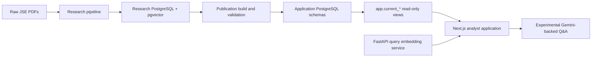
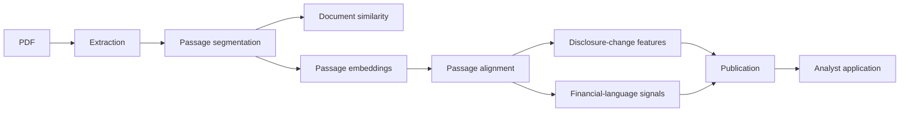

# Market Documents Intel

Market Documents Intel is an analyst-facing application for comparing narrative disclosures across consecutive corporate reports.

The project is inspired by Lauren Cohen, Christopher Malloy, and Quoc Nguyen’s research paper [*Lazy Prices*](https://papers.ssrn.com/sol3/papers.cfm?abstract_id=1658471), which examines changes in U.S. Securities and Exchange Commission filings, including annual and quarterly reports, and studies whether those textual changes contain information about future firm behavior and market outcomes.

Market Documents Intel extends that document-comparison concept to a non-U.S. disclosure environment. Its initial corpus consists of required annual and integrated annual reports published by companies listed on the Johannesburg Stock Exchange (JSE).

**Live application:** [market-documents-intel.vercel.app](https://market-documents-intel.vercel.app/)

> The public application runs on free or low-cost infrastructure and may experience a cold start. The first page load or first analytical request can therefore take noticeably longer than subsequent requests.

The current application focuses on the engineering and methodological prerequisites for this kind of research: extracting difficult PDF reports, reconstructing their narrative content, matching related passages across years, calculating disclosure-change signals, and presenting the evidence to an analyst. Testing relationships between those signals and stock prices is a future research stage, not a current capability.

## Why JSE reports are a difficult comparison problem

The original *Lazy Prices* research operates in the relatively standardized environment of U.S. regulatory filings. SEC filings such as 10-Ks are generally organized around prescribed disclosure requirements and are often available as structured HTML or machine-readable filing content.

JSE annual and integrated annual reports present a different challenge. They are commonly published as visually designed PDFs whose section order, headings, typography, page layout, tables, charts, and infographics may change substantially from year to year. Repeated disclosures may also move to a different part of the report, and a report’s publication year may not match the fiscal period it represents.

The project therefore cannot simply compare the same numbered section across two filings. It must first solve a data-engineering and document-parsing problem, reconstruct meaningful passages, and then determine which passages correspond across reports even when the structure has changed.

## What the application does

The application helps an analyst answer questions such as:

- What narrative disclosures changed between two consecutive reports?
- Was a passage unchanged, lightly modified, substantially modified, added, removed, or structurally ambiguous?
- Did a disclosure move to a different part of the report?
- Which report pairs show the most material narrative change?
- How did financial tone, uncertainty, risk, governance, or strategy language change?
- What source passages support a finding?

The current application includes:

- Company and report-comparison views
- Passage-level evidence and alignment details
- Deterministic discovery findings
- Keyword passage search
- Semantic and hybrid retrieval
- An experimental, evidence-gated `/ask` workflow
- Publication versioning and rollback support

## Current status

The research pipeline is feature-complete for the current corpus and includes extraction, segmentation, similarity, embeddings, alignment, disclosure-change features, financial-language analysis, publication, and retrieval.

Current verified active-publication metrics:

| Metric | Count |
|---|---:|
| Companies in research database | 10 |
| Companies with active comparisons | 6 |
| Reports | 30 |
| Report pairs | 25 |
| Passages | 22,169 |
| Passage comparisons | 26,473 |
| Passage embeddings | 21,962 |
| Retrieval contexts | 36,597 |
| Discovery items | 49 |
| Q&A chunks | 6,107 |

The application is available publicly through Vercel, but the hosted demo uses free or low-cost infrastructure and may exhibit cold starts and other performance constraints.

## Architecture



The project has four main runtime areas:

1. **Research pipeline**  
   Python, SQLAlchemy, Alembic, PostgreSQL, and pgvector.

2. **Publication database**  
   A separate application schema and migration history containing immutable, versioned publications.

3. **Analyst frontend**  
   Next.js, React, TypeScript, server components, and read-only PostgreSQL access.

4. **Query embedding providers**  
   Local development uses a FastAPI service that embeds queries with the same model, revision, and CLS-token pooling used for stored passage vectors. The public Vercel deployment uses Cloudflare Workers AI for query-time embeddings because Vercel serverless functions cannot run the local Python/PyTorch service.

## Core design principles

### Deterministic analysis before generation

The primary analytical outputs are produced by explicit extraction, matching, scoring, and classification rules. Generative AI is not used to determine whether a passage changed or how two passages align.

### Multiple metrics instead of one opaque score

Document similarity is represented through several complementary metrics:

- Pair-local lexical cosine similarity
- Bigram Jaccard similarity
- Token-sequence similarity
- Token-level edit similarity
- Word-count change

These metrics intentionally remain separate because they detect different phenomena. For example, a reorganized report may retain similar vocabulary while showing lower sequence similarity.

### Content-based alignment

Passage alignment uses semantic, lexical, heading, and position evidence, but passage acceptance is based on content rather than location.

```text
combined_score =
    0.50 × semantic_similarity
  + 0.30 × lexical_component
  + 0.10 × heading_similarity
  + 0.10 × position_similarity

content_score =
  (
      0.50 × semantic_similarity
    + 0.30 × lexical_component
    + 0.10 × heading_similarity
  ) / 0.90
```

A candidate must currently have a content score of at least `0.45` to be accepted.

Position remains useful for ranking and tie-breaking, but it cannot cause a strong content match to be rejected merely because the disclosure moved to another part of the report.

### Explicit ambiguity

The system does not force every passage into a match.

Modification labels apply only to accepted earlier/later passage pairs. A passage with no accepted one-to-one counterpart is instead represented as:

- `NEW`, when it appears only in the later report
- `REMOVED`, when it appears only in the earlier report
- `AMBIGUOUS`, when the system finds plausible split or merge evidence but not enough evidence for a confident one-to-one match

### Quality is separate from mechanical success

A pipeline run may complete successfully while its output is still marked `USABLE`, `NEEDS_REVIEW`, or `FAILED` based on content quality.

This prevents a mechanically successful extraction or alignment from being treated as analytically reliable by default.

### Full lineage and reproducibility

Each major stage records:

- Algorithm version
- Configuration hash
- Source run identifiers
- Completion status
- Quality status
- Warnings and audit metadata

Failed reruns do not displace earlier successful outputs. Current runs are resolved through queries rather than mutable `is_current` flags.

## Processing pipeline



### 1. Report registration and pairing

Reports are identified by company and fiscal period end, not by directory name or nominal fiscal-year label.

This matters because JSE report archives may organize a report by publication year even when the report covers a different fiscal period.

Transition periods are explicitly flagged and excluded from primary analysis rankings.

### 2. PDF extraction

PDF extraction uses PyMuPDF.

The pipeline retains:

- Page number
- Page dimensions
- Text-block coordinates
- Font size
- Bold status
- Reading order
- Block classification
- Narrative-inclusion status

Encrypted PDFs with an empty user password are opened in memory. No decrypted PDF is written to disk.

Extraction failures, true password protection, empty documents, and low-text or image-heavy pages are surfaced explicitly.

### 3. Text cleaning and block classification

The text-cleaning pipeline applies:

1. Unicode NFKC normalization
2. Control-character removal
3. Conservative hyphenation repair
4. Wrapped-line joining
5. Whitespace normalization

Extracted blocks are classified using ordered rules for:

- Repeated headers and footers
- Page numbers
- Decorative fragments
- Overlapping-text artifacts
- Table-like content
- Numeric fragments
- List items
- Heading candidates
- Paragraphs

All blocks remain persisted for auditability, even when they are excluded from the narrative.

### 4. Passage segmentation

Narrative blocks are grouped into passages using heading boundaries and word-count targets.

Default passage configuration:

| Setting | Value |
|---|---:|
| Preferred minimum | 150 words |
| Preferred maximum | 250 words |
| Hard maximum | 400 words |
| Hard-floor warning threshold | 15 words |

Passages are split rather than truncated.

A small residual set may still exceed the embedding model’s 512-token limit because token count and word count are not identical. Those passages are skipped for embedding rather than silently truncated.

### 5. Whole-document similarity

The project calculates four primary document-level text similarity metrics.

#### Pair-local lexical cosine

A vocabulary is built only from the two reports being compared.

Term frequency uses:

```text
tf(term, document) = 1 + log(term_count)
```

No inverse-document-frequency weighting is used. This keeps a report-pair score reproducible even as more reports are added to the corpus.

#### Bigram Jaccard

Measures overlap in two-word sequences:

```text
|A ∩ B| / |A ∪ B|
```

This captures retained phrasing and local word order.

#### Sequence similarity

Uses Python `SequenceMatcher` over token sequences with `autojunk=False`.

The metric is skipped above a configured token limit rather than silently switching to a different heuristic.

#### Edit similarity

Uses normalized token-level Levenshtein similarity to measure insertion, deletion, and substitution effort.

### 6. Passage embeddings

Model:

```text
BAAI/bge-small-en-v1.5
```

Key properties of the stored corpus embeddings:

- Pinned model revision
- 384 dimensions
- CLS-token pooling
- L2-normalized vectors
- No role-dependent query/document prefix
- One vector per passage
- 512-token model limit
- Skip-not-truncate policy

The research alignment layer defaults to exact cosine search because candidates are restricted to a relatively small report-specific pool.

The application search layer defaults to HNSW for full-publication semantic retrieval.

#### Local and production query embeddings

Local query embeddings are generated by the project’s FastAPI/PyTorch service using the same `BAAI/bge-small-en-v1.5` weights and CLS-token pooling used to create the stored passage vectors.

The public Vercel application cannot run that Python/PyTorch service inside its serverless functions. It therefore uses Cloudflare Workers AI as the query-embedding provider.

Although Cloudflare exposes the same base BAAI model, its hosted implementation uses mean pooling across token embeddings rather than the CLS-token pooling used for the stored corpus. Production semantic queries therefore compare:

```text
mean-pooled query vectors
against
CLS-pooled stored passage vectors
```

This is a representational mismatch, not evidence that the underlying model weights are inferior.

A compatibility experiment using 146 deterministic queries against the production Neon corpus measured:

| Compatibility measure | Result |
|---|---:|
| Mean cosine similarity between local and Cloudflare query vectors | 0.972 |
| Top-5 retrieval overlap | 82.6% |
| Top-10 retrieval overlap | 84.7% |
| MRR for locating the local top-1 result in Cloudflare results | 0.876 |

The result is approximately 13–17% retrieval divergence between the two query-embedding paths. This tradeoff was measured and accepted for the current Vercel architecture because the practical alternatives require a separately hosted query-embedding service.

### 7. Passage alignment

For each later-report passage, the pipeline retrieves the top semantic candidates from the earlier report and calculates:

- Semantic similarity
- Lexical composite similarity
- Heading similarity
- Position similarity
- Combined score
- Content score

The lexical component is the mean of available lexical cosine, bigram Jaccard, and edit similarity values.

Accepted candidates are assigned through a deterministic greedy process, followed by bounded local-exchange refinement.

### Collision flag

A collision flag means an accepted earlier passage also appeared as an acceptable candidate for another later passage, or duplicates another earlier passage by exact content hash.

A collision therefore indicates a non-unique or competing match, not necessarily an incorrect match.

Collision flags feed confidence and review logic. They are common in annual reports because of repeated templates, boilerplate, and recurring disclosures.

### Split and merge detection

The pipeline looks for plausible structural relationships involving unmatched passages.

A lower evidence threshold applies to nearby passages, while a higher threshold applies to distant passages to reduce false positives from repeated boilerplate.

Current production output remains primarily one-to-one. The schema supports future one-to-two and two-to-one alignments.

### 8. Matched and unmatched passage classifications

A key distinction is that modification classifications apply only to **accepted matched passage pairs**.

#### Accepted matched passage pairs

An accepted earlier/later pair can be classified as:

- `UNCHANGED`
- `LIGHTLY_MODIFIED`
- `SUBSTANTIALLY_MODIFIED`

The `UNCHANGED` rule uses **AND logic**. All three conditions must be satisfied:

```text
semantic similarity >= 0.95
AND lexical composite >= 0.90
AND length ratio >= 0.85
```

A matched pair is `LIGHTLY_MODIFIED` when its semantic similarity is at least `0.85` and it did not meet all three `UNCHANGED` conditions.

Any accepted matched pair that meets neither rule is `SUBSTANTIALLY_MODIFIED`.

#### Unmatched passages

An unmatched passage cannot be classified as unchanged, lightly modified, or substantially modified because those labels require an accepted earlier/later pair.

Instead:

- `NEW` means the passage appears only in the later report
- `REMOVED` means the passage appears only in the earlier report
- `AMBIGUOUS` means the passage remains unmatched, but the system detects plausible split or merge evidence that is not strong enough for an accepted one-to-one match

Confidence is reported separately as:

- `HIGH`
- `MEDIUM`
- `LOW`
- `NEEDS_REVIEW`

## How passage results roll up to report-level results

The application contains two distinct kinds of report-pair metrics.

### Direct whole-document metrics

These are calculated directly from the complete cleaned narratives:

- Lexical cosine
- Bigram Jaccard
- Sequence similarity
- Edit similarity
- Word-count change

They do not depend on passage alignment and are not averages of passage-level scores.

### Passage-derived report features

Other report-level outputs are aggregated from passage-alignment rows. These include:

- Disclosure-change score
- Word share by alignment status
- Passage and word alignment coverage
- Ambiguous-word share
- Low-confidence share
- Collision-flagged word share
- New-disclosure and removed-disclosure language rates
- Some financial-language change measures

This distinction matters because a report pair can have high whole-document lexical similarity while still containing a small number of highly material passage-level additions, removals, or rewrites.

### 9. Disclosure-change features

The disclosure-change score is a word-weighted magnitude measure.

```text
score =
  Σ(feature-eligible word share for status × status weight)
```

Current provisional weights:

| Status | Weight |
|---|---:|
| Unchanged | 0.00 |
| Lightly modified | 0.25 |
| Substantially modified | 0.65 |
| New | 0.85 |
| Removed | 0.85 |
| Ambiguous | 0.50 |

The score is bounded to `[0, 1]`.

It measures how much narrative disclosure changed, not whether the change was positive or negative.

The score is set to null when alignment or embedding coverage is insufficient.

### 10. Financial-language analysis

The financial-language layer uses:

- Loughran-McDonald categories
- A versioned custom taxonomy
- Longest-phrase-first matching
- Controlled spelling variants
- Explicit negation handling
- Per-1,000-word normalization

Loughran-McDonald categories include:

- Positive
- Negative
- Uncertainty
- Litigious
- Constraining
- Strong modal
- Weak modal

Custom categories include:

- Risk
- Financial condition
- Governance
- Strategy

Example metrics:

```text
net_tone = positive_rate - negative_rate

forward_looking_caution_rate =
    uncertainty_rate + weak_modal_rate
```

Report-side language quality and alignment-change quality are assessed independently.

## Publication model

Research results are not queried directly by the frontend.

The publisher creates immutable application publications in separate `app` and `app_internal` schemas.

Publication lifecycle:

```text
PENDING
→ BUILDING
→ VALIDATING
→ READY
→ ACTIVE
→ SUPERSEDED
```

The application reads only through `app.current_*` views filtered to the active publication.

Promotion is explicit and atomic. A previously active publication becomes `SUPERSEDED`, allowing rollback by re-promoting a retained publication.

Deterministic UUIDs make rebuilding an unchanged publication idempotent at the row level.

## Search and retrieval

### Keyword search

Keyword search uses PostgreSQL full-text search with:

- `english` text configuration
- Weighted headings
- GIN-indexed generated `tsvector`
- `websearch_to_tsquery`
- `ts_rank`

Keyword remains the default retrieval mode because it produced the strongest ranking quality in the current evaluation.

### Semantic search

Semantic search embeds the user query and compares it with the stored passage vectors.

In local development, query and passage vectors use the same model revision and CLS-token pooling. In the public deployment, Cloudflare Workers AI uses the same base BAAI weights but mean-pools the query vector, while the stored passage vectors remain CLS-pooled.

This known pooling mismatch can change result ordering or cause a passage found locally to rank lower or disappear from the production top results. The query-embedding path remains server-to-server only, and raw vectors are not exposed to the browser.

### Hybrid search

Hybrid search combines lexical and semantic rankings with reciprocal rank fusion:

```text
RRF(document) = Σ 1 / (k + rank)
```

The current default `k` is `60`.

RRF is used instead of directly adding lexical and cosine scores because those scores are not on comparable scales.

### Retrieval evaluation

The current evaluation contains 83 labeled cases.

| Mode | Recall@10 | MRR | nDCG@10 |
|---|---:|---:|---:|
| Keyword | 0.651 | 0.085 | 0.186 |
| Semantic, remediated | 0.590 | 0.035 | 0.126 |
| Hybrid, remediated | 0.663 | 0.080 | 0.126 |

Hybrid produced slightly higher recall, but keyword produced the best MRR and nDCG@10. Keyword therefore remains the production default.

These results should be treated as directional because the evaluation dataset is still modest.

## Frontend

The analyst application uses:

- Next.js
- React
- TypeScript
- App Router
- Server Components
- PostgreSQL `pg` driver
- Zod
- Recharts

Primary routes include:

```text
/
/methodology
/companies/[ticker]
/comparisons/[comparisonId]
/comparisons/[comparisonId]/evidence
/discover
/passages
/passages/[passageComparisonId]
/ask
/evidence-review
```

The frontend connects only through `APP_READONLY_DATABASE_URL`.

Database access is server-only and uses parameterized SQL.

## Security model

The project separates database responsibilities across three credentials:

- `DATABASE_URL`: research database
- `APP_DATABASE_URL`: publication writer
- `APP_READONLY_DATABASE_URL`: frontend read-only access

The read-only role can select from active-publication views but cannot query publication bookkeeping or underlying historical tables directly.

Other controls include:

- Server-only database access
- Parameterized SQL
- Statement and connection timeouts
- Query-length and page-size caps
- CSP and standard security headers
- No browser access to raw embedding vectors
- No external embedding provider

The experimental `/ask` route uses Gemini for answer generation only.

## Repository layout

```text
.
├── src/market_documents/
│   ├── cli/                    # Typer CLI entry points
│   ├── embedding_service/      # FastAPI query embedding service
│   ├── models/                 # Research SQLAlchemy models
│   ├── publishing/             # Application publication models and logic
│   └── services/               # Extraction, similarity, alignment, features, language
├── migrations/                 # Research database Alembic migrations
├── migrations_app/             # Application database Alembic migrations
├── web/
│   ├── app/                    # Next.js routes
│   ├── evaluation/             # Retrieval evaluation data and harness
│   ├── lib/                    # DB, repositories, services, domain, schemas
│   └── tests/                  # Frontend and production tests
├── config/                     # Versioned analytical configuration and taxonomy
├── data/
│   ├── raw/                    # Local raw PDFs
│   └── audits/                 # Generated audit CSVs
├── scripts/sql/                # Role and operational SQL
├── docs/                       # Technical documentation
├── alembic.ini
├── alembic_app.ini
├── docker-compose.yml
├── Dockerfile
└── pyproject.toml
```

## Developer setup and data availability

The repository does **not** include the raw JSE report PDFs or the currently published analytical corpus.

Cloning the repository is sufficient to:

- Inspect and modify the code
- Run unit tests and fixtures
- Work on database migrations
- Develop frontend components
- Run portions of the pipeline against independently acquired test reports

It is not sufficient to reconstruct the current published dataset.

Anyone wishing to reproduce the research corpus must independently obtain the reports, verify their fiscal-period metadata, register and pair them, run the research pipeline, and comply with the reports’ access and redistribution terms.

A development environment requires Python, Node.js and pnpm, PostgreSQL with pgvector, research and application database credentials, and the FastAPI query embedding service for semantic or hybrid search. A Gemini API key is required only for the experimental Q&A route.

Apply the database migrations with:

```bash
alembic upgrade head
alembic -c alembic_app.ini upgrade head
```

Initialize the application roles using the project role setup, including:

```text
scripts/sql/app_roles.sql
```

Start the frontend with:

```bash
cd web
pnpm install
pnpm dev
```

## Testing

### Python

```bash
python -m pytest
```

Last verified result:

```text
803 collected
800 passed
3 skipped
0 failed
```

### Frontend

```bash
cd web
pnpm test -- --run
```

The last verified run included repository-integration failures caused by the local application-test database environment. Before treating the frontend suite as fully green, reapply the application migrations and role grants to the configured test database.

### Retrieval evaluation

The retrieval evaluation harness and results are under:

```text
web/evaluation/
```

Retrieval results are analytical outputs, not a binary CI pass/fail gate.

## Public deployment constraints

The [public Vercel application](https://market-documents-intel.vercel.app/) is intended as a low-cost demonstration environment rather than a fully provisioned production deployment.

This can cause:

- Cold starts on the first request
- Slower initial database or service access
- Limited compute and memory
- Free-tier request and quota constraints
- No dedicated high-capacity model-serving infrastructure
- No premium semantic reranker
- Greater sensitivity to external provider latency and availability

The project uses the free, open `BAAI/bge-small-en-v1.5` model for its corpus embeddings. Locally, query embeddings are generated with the matching CLS-pooling implementation. In production, query-time embedding is delegated to Cloudflare Workers AI because the local Python/PyTorch service cannot run within the current Vercel serverless architecture.

Cloudflare uses the same base model weights but mean pooling rather than CLS pooling. The resulting query/document mismatch produces measured retrieval divergence even though both paths are described as using the same model. In a 146-query compatibility experiment, top-5 overlap was 82.6%, top-10 overlap was 84.7%, and the MRR for recovering the local top-ranked result was 0.876.

The experimental `/ask` workflow is affected more than the deterministic comparison pages because it depends on query interpretation, retrieval, evidence gating, and external answer generation all working well together. A retrieval miss caused by the pooling mismatch can prevent the correct evidence from reaching the generation step. The hosted `/ask` experience may therefore perform worse than the local path using matched CLS-pooled query embeddings.

The comparison, evidence, and methodology pages are more representative of the project’s core analytical capability.

## Known limitations

- The public application can experience cold starts.
- The raw report corpus is not distributed with the repository.

- Authentication is not yet implemented.
- The disclosure-change weights are provisional.
- The semantic weak-match threshold is provisional.
- Semantic retrieval is vulnerable to short-fragment similarity inflation.
- Production query embeddings use Cloudflare mean pooling while stored passage embeddings use local CLS pooling, producing a measured 13–17% retrieval divergence.
- A small number of overlength passages are skipped for embedding.
- Residual structured-content artifacts remain possible.
- The frontend does not yet include an embedded PDF viewer.
- The `/ask` route is experimental, depends on Gemini availability and quota, and may perform worse in the public deployment.
- Exact comparison linkage for some Q&A contexts remains deferred.
- No market-outcome or predictive validation has been performed.

## Future enhancements

### Research extensions

- Compare disclosure-change signals with subsequent stock-price behavior
- Test whether JSE disclosure changes exhibit relationships similar to those examined in *Lazy Prices*
- Examine abnormal returns, trading volume, volatility, and other market-response measures
- Compare financial-language changes with subsequent operating or market outcomes
- Validate current disclosure-change weights against expert annotations or market-based targets

### Additional report types

- Interim and quarterly reports
- Sustainability and ESG reports
- Governance reports
- Earnings announcements
- Trading statements
- Other exchange-required disclosures

Adding these report types would require report-specific pairing rules, quality criteria, and interpretation because not every document has the same purpose or reporting cadence.

### Corpus expansion

- Add more JSE-listed companies
- Extend company histories across more reporting periods
- Add other African exchanges
- Evaluate the approach on additional non-U.S. disclosure regimes
- Improve handling of fiscal-period changes and transition reports

### Methodological improvements

- Produce accepted one-to-two and two-to-one passage alignments
- Improve long-passage embedding coverage
- Improve extraction of tables, charts, and infographic text
- Evaluate alternative embedding models
- Deploy a dedicated query-embedding service that reproduces the corpus model revision and CLS-pooling behavior
- Re-embed the corpus with a provider-compatible pooling strategy if a future migration justifies the cost
- Add cross-encoder semantic reranking
- Expand the retrieval evaluation dataset
- Formally calibrate disclosure-change weights
- Improve exact comparison-aware Q&A contexts

### Product and deployment improvements

- Add authentication and authorization
- Add an embedded PDF viewer
- Highlight source passages on original report pages
- Reduce public cold starts
- Deploy dedicated embedding infrastructure
- Improve Q&A reliability and provider fallback behavior
- Add downloadable comparison and audit reports
- Add analyst annotations and review workflows

## Appropriate use

The system is suitable for:

- Accelerating year-over-year report review
- Surfacing candidate disclosure changes
- Comparing narrative structure and wording
- Screening for financial-language changes
- Locating and citing relevant report passages

It is not intended for:

- Autonomous investment decisions
- Predictive market claims
- Unreviewed legal, financial, or compliance conclusions
- Replacing verification against the source report

Market Documents Intel is an analyst-augmentation tool. It helps a reviewer find, compare, and inspect evidence more efficiently; it does not eliminate the need for analyst judgment.

## Methodology caveats

A few implementation values are intentionally treated as provisional rather than externally validated:

- Disclosure-change status weights
- Semantic weak-match threshold
- Some quality and disagreement thresholds
- Retrieval conclusions based on the current 83-case evaluation set

These values are versioned and auditable so they can be recalibrated without overwriting historical results.

## Glossary

**Active publication**  
The single promoted publication visible through `app.current_*` views.

**Alignment**  
A correspondence between an earlier-report passage and a later-report passage.

**Collision flag**  
An indicator that multiple passages compete for the same candidate match, or that duplicate passage content exists.

**Content score**  
The semantic, lexical, and heading-based passage-match score used for acceptance.

**Disclosure-change score**  
A bounded, word-weighted measure of the magnitude of narrative change.

**Matched passage pair**  
An earlier-report passage and later-report passage accepted as corresponding content.

**Primary eligible**  
A result that passes quality, coverage, reporting-gap, and transition-period gates for inclusion in primary rankings.

**Retrieval context**  
A citable interpretation of a passage within a specific comparison and report side.

**Review qualified**  
A result that remains visible but should be interpreted cautiously because it failed one or more primary-eligibility checks.

**Unmatched passage**  
A passage with no accepted one-to-one counterpart. It may be classified as new, removed, or ambiguous.

## References

- Lauren Cohen, Christopher Malloy, and Quoc Nguyen, [*Lazy Prices*](https://papers.ssrn.com/sol3/papers.cfm?abstract_id=1658471)
- [Market Documents Intel public application](https://market-documents-intel.vercel.app/)
- Loughran-McDonald Master Dictionary, loaded locally and not redistributed by this repository

## License and data rights

Repository licensing and source-report redistribution terms should be documented explicitly before public release.

The Loughran-McDonald dictionary is loaded from a local file and is not redistributed by the project.

JSE report access, storage, and redistribution should remain consistent with the source publishers’ terms and the intended research or client use of the system.
